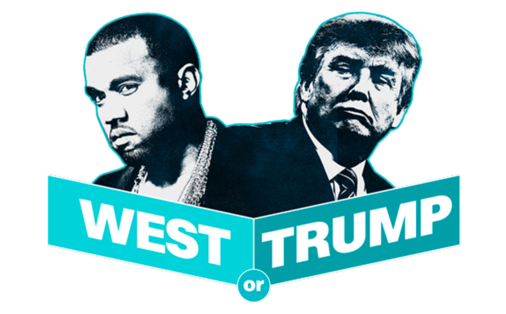
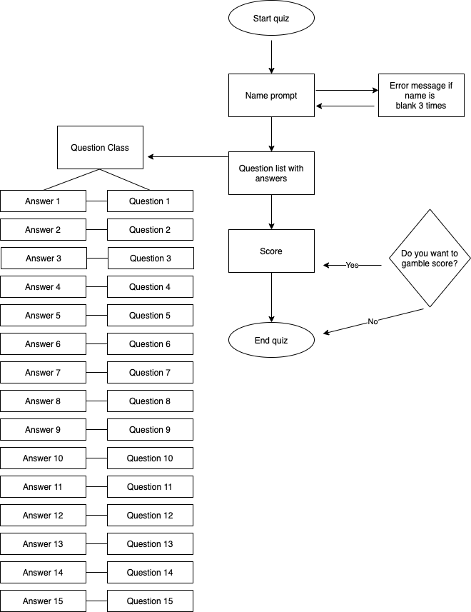
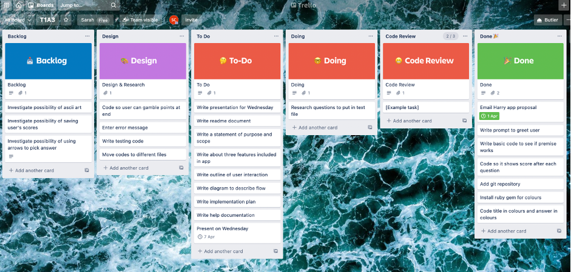
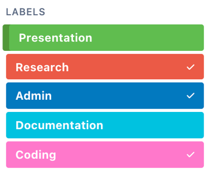
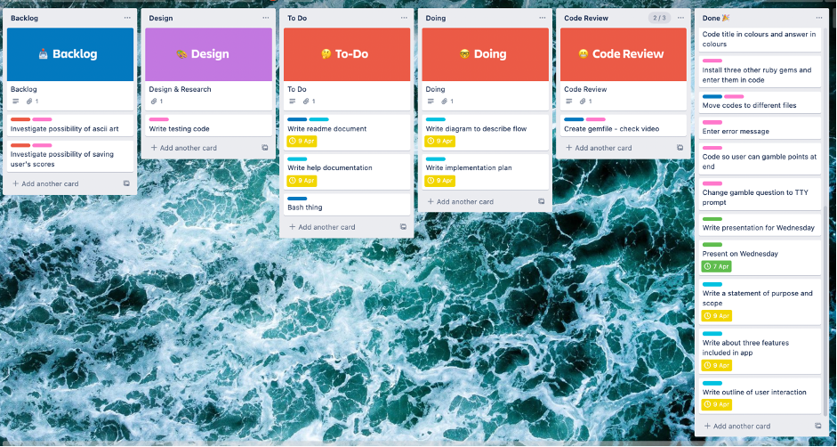

# T1A3 - Sarah Cahill

##Trump v Kanye Quiz CLI



###Project Links

[Github](https://github.com/sarcah/T1A3)

###Purpose and scope of the application
####What does Trump v Kayne Quiz CLI do?

The *Trump v Kanye Quiz* is a command line quiz that provides the user with 15 multiple choice questions. Users are asked to enter their name, and the program refers to them as this name from then on. If they do not enter a value, they are prompted to re-enter their name. The instructions for the quiz are then displayed on the screen, with the design aiming to be clear and easy to read. The quiz then starts, with 15 quotes from Twitter and users have to identify the author – Trump or Kanye. If they get the correct answer, they receive a point are told their cumulative score. If they get it wrong, they are told their answer is incorrect.<br>
At the end of the quiz, the user is given their score out of the total answers. They are then given the opportunity to double or nothing – to gamble all their points on the last question. They are then told their new score based on their answer to the final question.<br>
The code in the app uses **Classes** for object orientated programming, **Variables** associated with objects, **Loops** to run through the question lists, and **Input and Output** statements for user interaction.<br><br>

####What problem does this app solve? 
This app doesn’t necessarily solve a problem - possibly boredom! It does improve user’s knowledge of the Donald Trump’s and Kanye West’s social media outputs; perhaps it’s a commentary on the state of politics and entertainment…<br><br>

####Target audience 
This is a fun tongue-in-cheek app to entertain users and allow them to test their knowledge about popular culture figures. It is designed to be played by users with minimal to no knowledge of the command line, as they only have to answer simple prompts. Users who have never heard of Trump of Kanye can still play, as there are only two options to pick from so they still have a chance of being right.

Inputs are entered as ‘Name’, typing ‘Trump’ or ‘Kanye’ for each question (case insensitive) and then selecting Yes or No at end when deciding whether or not to gamble.<br><br>

####Trump v Kanye Features
Some of the features of the app include asking users to input their name, using colour and boxes to improve the usability of the app and the UX, displaying the cumulative score as users move through the quiz and allowing users to gamble their points at the end.<br>
#####Feature 1 – Name prompt
The first step of the app asks the user to enter their name, in order to engage them from the beginning and to personalise the user experience. The program then includes the user name in the intro text, and also at the end when telling them their score. Error handling is utlised in the name prompt. If the user presses enter without typing their name, they are given an error message “Name cannot be empty”. They are given three opportunities to enter their name – if a blank value is returned each of the three times, the program will exit.<br>
######Feature 2 – Display output
Ruby gems have been used in the app to enhance readability and make the user experience positive. This includes use of coloured text, of bold and italic text stylings, boxes to separate the text to ensure instructions are read and a hyperlink gem to allow the user to visit the credited side directly from the terminal.<br>
######Feature 3 – Cumulative score total
The app also includes the feature of giving users a cumulative total of their points as they go through the quiz questions. To improve user experience, the message for an incorrect answer is shown in <span style="color:red">red</span>, and the message for a correct answer is shown in <span style="color:green">green</span>. If the answer is correct they are shown the total. This is done through setting the score to originally to be 0, looping through each question in the questions list and increasing the score by 1 when the answer is equal to the answer in the questions array. Once the method has been executed for all the questions, it moves on to the next stage of the program.<br>
#####Feature 4 – Gamble your points
After the user is given their score, they are presented with a Yes/No TTY-prompt asking if they want to gamble their points. If they choose no, they exit the game with a ‘thanks for playing’ message. If they choose yes, they are given a final question to choose between Trump and Kanye. This then enters an if/else statement which gives an output based on their answer, their final score and a farewell message including their previously input of their name.<br><br>

####An outline of user interaction
The user interaction is quite simple – they are prompted to enter their name, the answers, their option for gambling the points, and then the final answer. They app does not allow for user navigation, as the goal is for them to work through the question list and to answer all questions. If they user does not want to answer a question, they can simply press enter and it will move on to the next question. <br> 
As stated in the question above, the error handling for ‘name’ is done through the begin/rescue exception. A possible weakness in the app is that a user may mis-type ‘Trump’ or ‘Kanye’ and not get the points, though they did get the answer right (the code only allows for inputs to be rendered case insensitive). This could be mitigated by utlising TTY-prompt (as is done for the end question where users are only given the two options). However, having the user enter the answers increases their involvement and engagement with the game. When they are given instructions at the beginning of the game, they are warned to be careful of their spelling.

####Control flow diagram for the app

<br><br>

####Implementation plan - Trello
Link to the live Trello board is [here](https://trello.com/b/eNz0zVIf/t1a3)

The below image is of my initial Trello plan, which allowed me to organise tasks (including some wishlist items in backlog), ensuring all items were completed in a timely manner to hand assignment in on time, and that no requirements were missed. Time sensitive items were given a due date. 


As I moved through the assignment, the Trello board was updated with new tasks, new dates and labels added, a further screenshot is below. Rather than adding checklists for each feature, I used more individual features (like having seven individual entries around documentation) as this allowed me to break up the tasks into more achievable goals and to more easily see what still needed to be done (and to get the psychological win of being able to move more items to the Done list)



<br><br>

####System requirements
The computer needs bash script capability.<br><br>

####Installation of the application
•	If not already installed, follow these [instructions](https://www.ruby-lang.org/en/documentation/installation/) to download and install Ruby on your computer.
•	Download the Zip file and extract it onto your computer, or clone the Github repository.
•	Open your terminal and run the following command after navigating to the projects main folder.
```
$ gem install bundler
```
•	After bundle is installed, run below command:
```
$ bundle install
```
•	Then to launch the application enter below:
```
$ ./run_app.sh
```
